# Class Diagram - System Architecture

## Entity Relationships

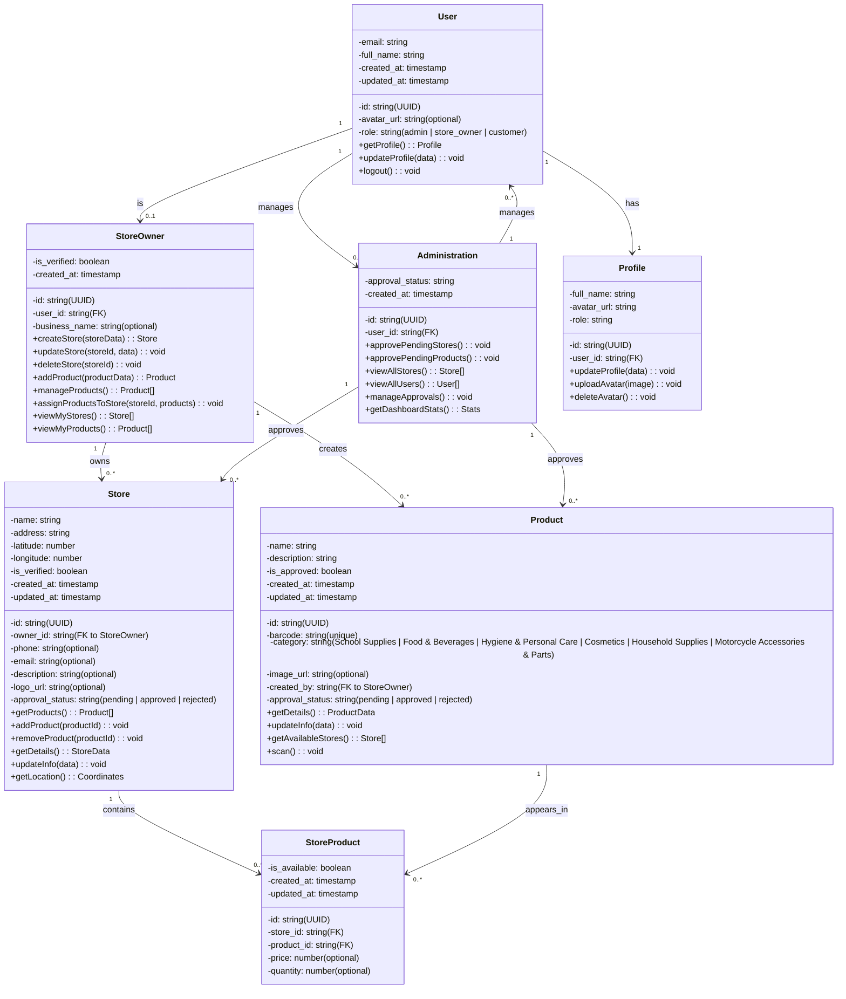

## Entity-Relationship Diagram

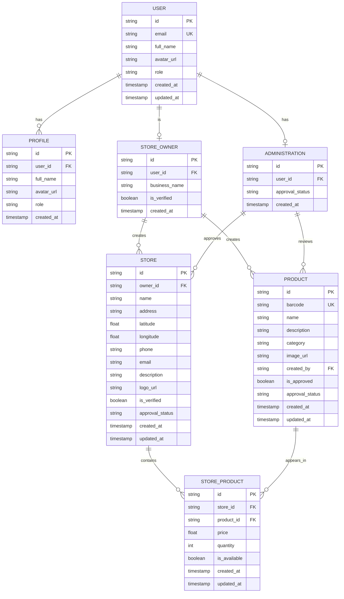

## Key Relationships Explained

### User → Administration
- **Type**: One-to-One Optional
- **Meaning**: A User can have an Administration role (admin users only)
- **Example**: User with role="admin" creates an Administration record

### User → StoreOwner
- **Type**: One-to-One Optional
- **Meaning**: A User can be a StoreOwner (store owner users only)
- **Example**: User with role="store_owner" creates a StoreOwner record

### User → Profile
- **Type**: One-to-One Required
- **Meaning**: Every User has exactly one Profile
- **Example**: Extended user information like avatar, full name, role

### StoreOwner → Store (1:N)
- **Type**: One-to-Many
- **Meaning**: One StoreOwner can create and own multiple Stores
- **Example**: Maria can own "Maria's Bakery", "Maria's Cafe", etc.

### StoreOwner → Product (1:N)
- **Type**: One-to-Many
- **Meaning**: One StoreOwner can create multiple Products
- **Example**: Store owner creates products for their stores

### Store → StoreProduct (1:N)
- **Type**: One-to-Many
- **Meaning**: One Store can contain many Products (via StoreProduct junction table)
- **Example**: Maria's Bakery sells Bread, Pastries, Cakes, etc.

### Product → StoreProduct (1:N)
- **Type**: One-to-Many
- **Meaning**: One Product can be sold in many Stores (via StoreProduct junction table)
- **Example**: "Marlboro Cigarettes" is available in multiple stores

### Administration → Store (1:N)
- **Type**: One-to-Many
- **Meaning**: Admins can approve/reject multiple Stores
- **Example**: Admin reviews pending store registrations

### Administration → Product (1:N)
- **Type**: One-to-Many
- **Meaning**: Admins can approve/reject multiple Products
- **Example**: Admin reviews products for compliance

## Roles & Permissions

| Entity | Role | Actions | Approval Required |
|--------|------|---------|-------------------|
| **Administration** | admin | View all users, stores, products; Approve/reject stores & products | No |
| **StoreOwner** | store_owner | Create stores; Add/manage products; View own stores/products | Yes (store & products) |
| **User** | customer | View stores & products; Search; View profiles | No |

## Status Workflow

### Store Approval Workflow
```
pending → approved (by admin)
       ↘ rejected (by admin)
```

### Product Approval Workflow
```
pending → approved (by admin)
       ↘ rejected (by admin)
```

## Database Schema (PostgreSQL)

The system is built on PostgreSQL with Supabase integration, with the following main tables:
- `auth.users` - Supabase authentication
- `public.profiles` - Extended user information
- `public.store_owners` - Store owner records
- `public.administrators` - Admin records
- `public.stores` - Store information
- `public.products` - Product catalog
- `public.store_products` - Junction table for many-to-many relationship

---

# Use Case Diagram - System Functionality

## Main Use Case Diagram

```mermaid
graph TB
    subgraph "ScanWizard System"
        direction TB
        
        subgraph "Authentication"
            UC1["Login"]
            UC2["Sign Up"]
            UC3["Forgot Password"]
            UC4["Reset Password"]
            UC5["Logout"]
        end
        
        subgraph "Customer"
            UC6["Scan Product"]
            UC7["View Product Details"]
            UC8["Search Products"]
            UC9["View Nearby Stores"]
            UC10["View Store Details"]
            UC11["View Profile"]
            UC12["Edit Profile"]
            UC13["View About Us"]
            UC14["Contact Us"]
        end
        
        subgraph "Store Owner"
            UC15["Create Store"]
            UC16["Manage Stores"]
            UC17["Add Product"]
            UC18["Manage Products"]
            UC19["Assign Products to Store"]
            UC20["View My Shops"]
            UC21["Update Store Details"]
        end
        
        subgraph "Administration"
            UC22["View Dashboard"]
            UC23["Approve Stores"]
            UC24["Reject Stores"]
            UC25["Approve Products"]
            UC26["Reject Products"]
            UC27["View All Stores"]
            UC28["View All Users"]
            UC29["View Pending Approvals"]
        end
    end
    
    Customer["👤 Customer"]
    StoreOwner["🏪 Store Owner"]
    Admin["👨‍💼 Administrator"]
    
    %% Customer Use Cases
    Customer -->|uses| UC1
    Customer -->|uses| UC2
    Customer -->|uses| UC3
    Customer -->|uses| UC4
    Customer -->|uses| UC5
    Customer -->|performs| UC6
    Customer -->|performs| UC7
    Customer -->|performs| UC8
    Customer -->|performs| UC9
    Customer -->|performs| UC10
    Customer -->|performs| UC11
    Customer -->|performs| UC12
    Customer -->|performs| UC13
    Customer -->|performs| UC14
    
    %% Store Owner Use Cases
    StoreOwner -->|uses| UC1
    StoreOwner -->|uses| UC2
    StoreOwner -->|uses| UC3
    StoreOwner -->|uses| UC4
    StoreOwner -->|uses| UC5
    StoreOwner -->|performs| UC15
    StoreOwner -->|performs| UC16
    StoreOwner -->|performs| UC17
    StoreOwner -->|performs| UC18
    StoreOwner -->|performs| UC19
    StoreOwner -->|performs| UC20
    StoreOwner -->|performs| UC21
    StoreOwner -->|can perform| UC6
    StoreOwner -->|can perform| UC11
    
    %% Admin Use Cases
    Admin -->|uses| UC1
    Admin -->|uses| UC5
    Admin -->|performs| UC22
    Admin -->|performs| UC23
    Admin -->|performs| UC24
    Admin -->|performs| UC25
    Admin -->|performs| UC26
    Admin -->|performs| UC27
    Admin -->|performs| UC28
    Admin -->|performs| UC29
    
    style Customer fill:#4F46E5,stroke:#312E81,stroke-width:2px,color:#fff
    style StoreOwner fill:#10B981,stroke:#047857,stroke-width:2px,color:#fff
    style Admin fill:#F59E0B,stroke:#D97706,stroke-width:2px,color:#fff
```

## Detailed Use Case Diagram (Mermaid)

```mermaid
usecase diagram
    actor Customer as "Customer"
    actor StoreOwner as "Store Owner"
    actor Admin as "Administrator"
    actor System as "System"
    
    Customer -- (Scan Product)
    Customer -- (View Product Details)
    Customer -- (Search Products)
    Customer -- (View Nearby Stores)
    Customer -- (View Store Details)
    Customer -- (View Profile)
    Customer -- (Edit Profile)
    Customer -- (View About Us)
    Customer -- (Contact Us)
    
    StoreOwner -- (Create Store)
    StoreOwner -- (Manage Stores)
    StoreOwner -- (Add Product)
    StoreOwner -- (Manage Products)
    StoreOwner -- (Assign Products to Store)
    StoreOwner -- (View My Shops)
    
    Admin -- (View Dashboard)
    Admin -- (Approve/Reject Stores)
    Admin -- (View All Stores)
    Admin -- (View Pending Approvals)
    
    (Login) .> (Scan Product) : include
    (Login) .> (Create Store) : include
    (Login) .> (View Dashboard) : include
    
    (Manage Stores) .> (Update Store Details) : include
    (Manage Products) .> (View Product Details) : include
```

## Use Case Descriptions

### Authentication Use Cases

#### UC1: Login
- **Actor**: Customer, Store Owner, Administrator
- **Precondition**: User has valid credentials
- **Main Flow**:
  1. User enters email and password
  2. System validates credentials
  3. System checks user role
  4. System directs to appropriate dashboard
- **Postcondition**: User is authenticated and logged in
- **Alternative Flow**: 
  - Invalid credentials → Show error message
  - User doesn't exist → Suggest Sign Up

#### UC2: Sign Up
- **Actor**: Customer, Store Owner
- **Precondition**: User is not registered
- **Main Flow**:
  1. User enters full name, email, password
  2. System validates input
  3. System creates user account
  4. System creates profile
  5. User is automatically logged in
- **Postcondition**: New user account created and logged in

#### UC3: Forgot Password
- **Actor**: Customer, Store Owner
- **Precondition**: User is on login screen
- **Main Flow**:
  1. User clicks "Forgot Password"
  2. User enters email
  3. System sends reset link to email
  4. System shows confirmation message
- **Postcondition**: Password reset link sent to user's email

#### UC4: Reset Password
- **Actor**: Customer, Store Owner
- **Precondition**: User received password reset link
- **Main Flow**:
  1. User clicks reset link in email
  2. User enters new password
  3. System validates password requirements
  4. System updates password in database
  5. System shows success message
- **Postcondition**: Password reset successfully

#### UC5: Logout
- **Actor**: Customer, Store Owner, Administrator
- **Precondition**: User is logged in
- **Main Flow**:
  1. User clicks logout button
  2. System clears session data
  3. System redirects to login screen
- **Postcondition**: User is logged out

### Customer Use Cases

#### UC6: Scan Product
- **Actor**: Customer
- **Precondition**: User is logged in; device has camera permission
- **Main Flow**:
  1. User opens Scanner
  2. User points camera at barcode
  3. System scans and recognizes barcode
  4. System fetches product information
  5. System displays product details screen
- **Postcondition**: Product details displayed
- **Alternative Flow**:
  - Invalid barcode → Show "Product not found"
  - Camera permission denied → Request permission

#### UC7: View Product Details
- **Actor**: Customer, Store Owner
- **Precondition**: Product exists in system
- **Main Flow**:
  1. User views product information (name, description, category, image)
  2. System displays available stores selling this product
  3. System shows store locations and distances
- **Postcondition**: Product details and store information displayed

#### UC8: Search Products
- **Actor**: Customer
- **Precondition**: User is logged in
- **Main Flow**:
  1. User enters product name or category
  2. System searches product database
  3. System displays search results
  4. User selects product from results
- **Postcondition**: Product details displayed

#### UC9: View Nearby Stores
- **Actor**: Customer
- **Precondition**: User has location permission; GPS is enabled
- **Main Flow**:
  1. System retrieves user's current location
  2. System fetches all approved stores near user
  3. System displays stores on map
  4. System shows store details (name, address, distance)
- **Postcondition**: Store locations displayed on map

#### UC10: View Store Details
- **Actor**: Customer
- **Precondition**: Store is approved
- **Main Flow**:
  1. User selects store from search/map
  2. System displays store information (name, address, phone, products)
  3. System shows store location on map
  4. User can browse products available at store
- **Postcondition**: Store information displayed

#### UC11: View Profile
- **Actor**: Customer, Store Owner
- **Precondition**: User is logged in
- **Main Flow**:
  1. User opens Profile screen
  2. System displays user information (name, email, avatar, role)
  3. System shows profile completion status
- **Postcondition**: Profile information displayed

#### UC12: Edit Profile
- **Actor**: Customer, Store Owner
- **Precondition**: User is on Profile screen
- **Main Flow**:
  1. User clicks "Edit Profile"
  2. User modifies name, avatar, or contact information
  3. System validates new information
  4. System saves changes to database
  5. System shows success message
- **Postcondition**: Profile updated successfully

#### UC13: View About Us
- **Actor**: Customer
- **Precondition**: User is logged in
- **Main Flow**:
  1. User navigates to About Us section
  2. System displays application information and mission
- **Postcondition**: About information displayed

#### UC14: Contact Us
- **Actor**: Customer
- **Precondition**: User is logged in
- **Main Flow**:
  1. User navigates to Contact Us section
  2. System displays contact information and support options
  3. User can contact support via email/phone
- **Postcondition**: Contact information provided

### Store Owner Use Cases

#### UC15: Create Store
- **Actor**: Store Owner
- **Precondition**: User is logged in and verified; user role is store_owner
- **Main Flow**:
  1. User clicks "Add Store"
  2. User enters store name, address, latitude, longitude, phone, email
  3. System validates location data
  4. System creates store with approval_status = "pending"
  5. System sends notification to admin
  6. System shows success message
- **Postcondition**: Store created (pending admin approval)
- **Alternative Flow**:
  - Invalid coordinates → Show error
  - Missing required fields → Highlight fields and show error

#### UC16: Manage Stores
- **Actor**: Store Owner
- **Precondition**: Store owner has created stores
- **Main Flow**:
  1. User opens "My Stores"
  2. System displays list of user's stores
  3. User can select store to view/edit/delete
- **Postcondition**: Store list displayed

#### UC17: Add Product
- **Actor**: Store Owner
- **Precondition**: User is logged in; user role is store_owner
- **Main Flow**:
  1. User clicks "Add Product"
  2. User enters product name, barcode, description, category, image
  3. User can scan barcode or enter manually
  4. System validates barcode uniqueness
  5. System creates product with approval_status = "pending"
  6. System sends notification to admin
  7. System shows success message
- **Postcondition**: Product created (pending admin approval)
- **Alternative Flow**:
  - Barcode already exists → Show duplicate error
  - Invalid barcode format → Show format error

#### UC18: Manage Products
- **Actor**: Store Owner
- **Precondition**: Store owner has created products
- **Main Flow**:
  1. User opens "My Products" or "Manage Products"
  2. System displays list of user's products
  3. User can select product to view/edit/delete
- **Postcondition**: Product list displayed

#### UC19: Assign Products to Store
- **Actor**: Store Owner
- **Precondition**: Store owner has created products and stores
- **Main Flow**:
  1. User opens store details
  2. User clicks "Assign Products"
  3. System displays list of available products
  4. User selects products to add to store
  5. System updates store_products table
  6. System shows success message
- **Postcondition**: Products assigned to store

#### UC20: View My Shops
- **Actor**: Store Owner
- **Precondition**: Store owner is logged in
- **Main Flow**:
  1. User navigates to "My Shops"
  2. System displays all stores owned by user
  3. System shows store status (pending/approved/rejected)
  4. User can click store to view details
- **Postcondition**: Store list displayed with status

#### UC21: Update Store Details
- **Actor**: Store Owner
- **Precondition**: Store exists and is owned by user
- **Main Flow**:
  1. User selects store from "My Stores"
  2. User clicks "Edit"
  3. User modifies store information (name, address, phone, email, description, logo)
  4. System validates changes
  5. System saves changes
  6. System shows success message
- **Postcondition**: Store details updated

### Administration Use Cases

#### UC22: View Dashboard
- **Actor**: Administrator
- **Precondition**: Admin is logged in
- **Main Flow**:
  1. Admin opens Admin Dashboard
  2. System displays statistics:
     - Total stores count
     - Pending approvals count
     - Active stores count
  3. System displays last updated timestamp
  4. Admin can refresh data manually
- **Postcondition**: Dashboard statistics displayed

#### UC23: Approve Stores
- **Actor**: Administrator
- **Precondition**: There are pending stores
- **Main Flow**:
  1. Admin navigates to "Approvals"
  2. System displays pending stores
  3. Admin selects store and reviews details
  4. Admin clicks "Approve"
  5. System updates store status to "approved"
  6. System sends notification to store owner
  7. System shows success message
- **Postcondition**: Store approved and store owner notified

#### UC24: Reject Stores
- **Actor**: Administrator
- **Precondition**: There are pending stores
- **Main Flow**:
  1. Admin navigates to "Approvals"
  2. System displays pending stores
  3. Admin selects store and reviews details
  4. Admin enters rejection reason (optional)
  5. Admin clicks "Reject"
  6. System updates store status to "rejected"
  7. System sends notification to store owner with reason
  8. System shows success message
- **Postcondition**: Store rejected and store owner notified

#### UC25: Approve Products
- **Actor**: Administrator
- **Precondition**: There are pending products
- **Main Flow**:
  1. Admin navigates to "Approvals"
  2. System displays pending products
  3. Admin selects product and reviews details
  4. Admin clicks "Approve"
  5. System updates product status to "approved"
  6. System sends notification to store owner
  7. System shows success message
- **Postcondition**: Product approved and store owner notified

#### UC26: Reject Products
- **Actor**: Administrator
- **Precondition**: There are pending products
- **Main Flow**:
  1. Admin navigates to "Approvals"
  2. System displays pending products
  3. Admin selects product and reviews details
  4. Admin enters rejection reason (optional)
  5. Admin clicks "Reject"
  6. System updates product status to "rejected"
  7. System sends notification to store owner with reason
  8. System shows success message
- **Postcondition**: Product rejected and store owner notified

#### UC27: View All Stores
- **Actor**: Administrator
- **Precondition**: Admin is logged in
- **Main Flow**:
  1. Admin navigates to "All Stores"
  2. System displays all stores (approved, pending, rejected)
  3. System shows store owner information
  4. Admin can filter by status
  5. Admin can search stores by name
- **Postcondition**: Complete store list displayed

#### UC28: View All Users
- **Actor**: Administrator
- **Precondition**: Admin is logged in
- **Main Flow**:
  1. Admin navigates to user management section
  2. System displays all registered users
  3. System shows user role and registration date
  4. Admin can filter by role (customer, store_owner, admin)
  5. Admin can search users by name/email
- **Postcondition**: User list displayed with filters

#### UC29: View Pending Approvals
- **Actor**: Administrator
- **Precondition**: Admin is logged in
- **Main Flow**:
  1. Admin navigates to "Approvals"
  2. System displays all pending stores and products
  3. System shows pending count
  4. Admin can sort by date or priority
  5. Admin can filter by type (store/product)
- **Postcondition**: Pending items list displayed

## System Constraints

- **Authentication**: All use cases except Login, Sign Up, Forgot Password require user to be authenticated
- **Role-Based Access**: Each actor can only perform use cases assigned to their role
- **Approval Required**: Store Owner's created stores and products require Admin approval before they become visible to customers
- **Uniqueness**: Product barcodes must be unique across the system
- **Location Data**: Store creation requires valid latitude and longitude coordinates

## Actor Interactions

| Actor | Actions | Receives | Notes |
|-------|---------|----------|-------|
| **Customer** | Scan, Search, View, Browse | Product/Store info, Maps | Main end-user |
| **Store Owner** | Create, Manage, Assign, Submit | Approval status, Notifications | Needs approval from Admin |
| **Administrator** | View, Approve, Reject, Manage | Statistics, Pending items | Controls system approvals |
| **System** | Validate, Store, Notify, Route | Requests, Data updates | Backend services |

---

# Activity Diagram - System Workflows

## 1. Customer Product Scanning Flow

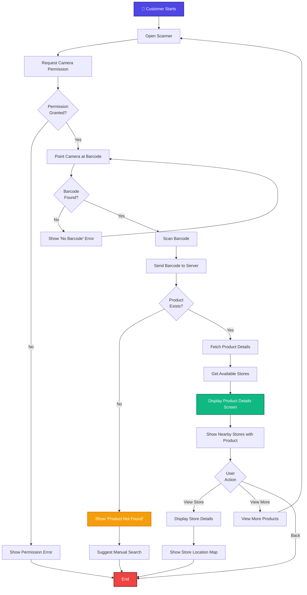

## 2. Store Owner Registration & Store Creation Flow

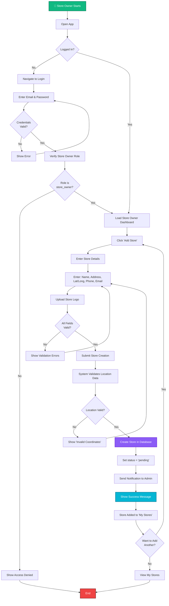

## 3. Product Creation & Approval Flow

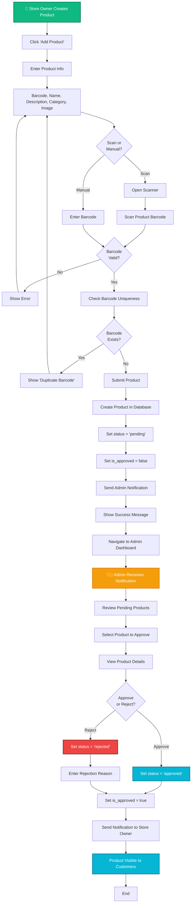

## 4. Admin Approval Workflow

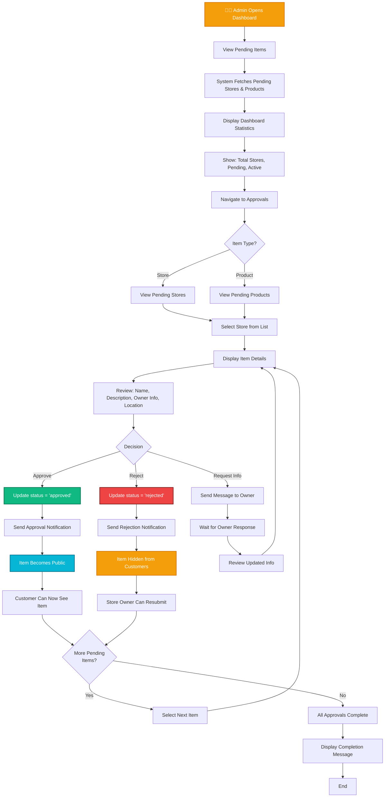

## 5. User Authentication Flow

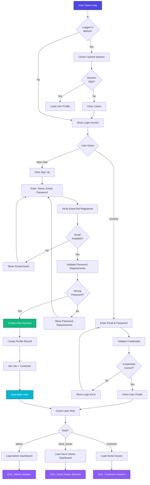

## 6. Search & Map Feature Flow

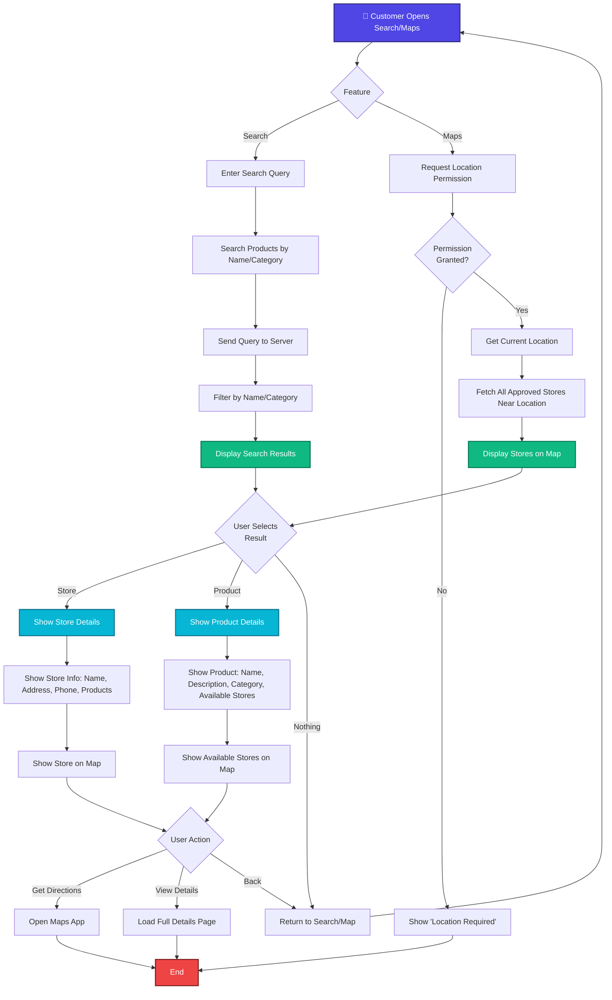

## 7. Profile Management Flow

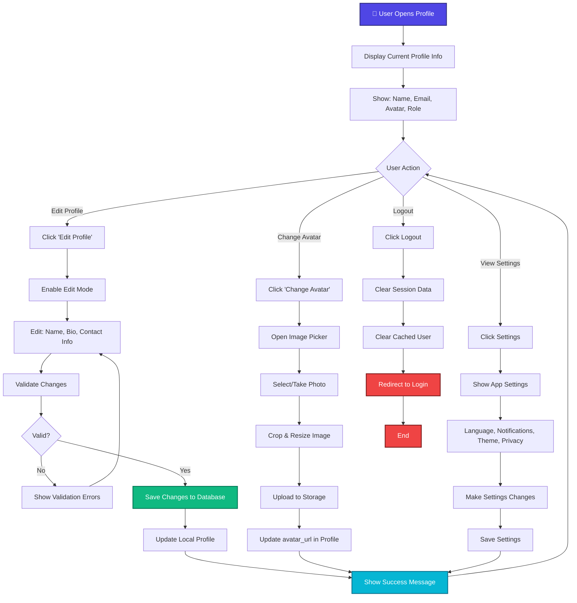

## 8. Complete System Flow (High Level)

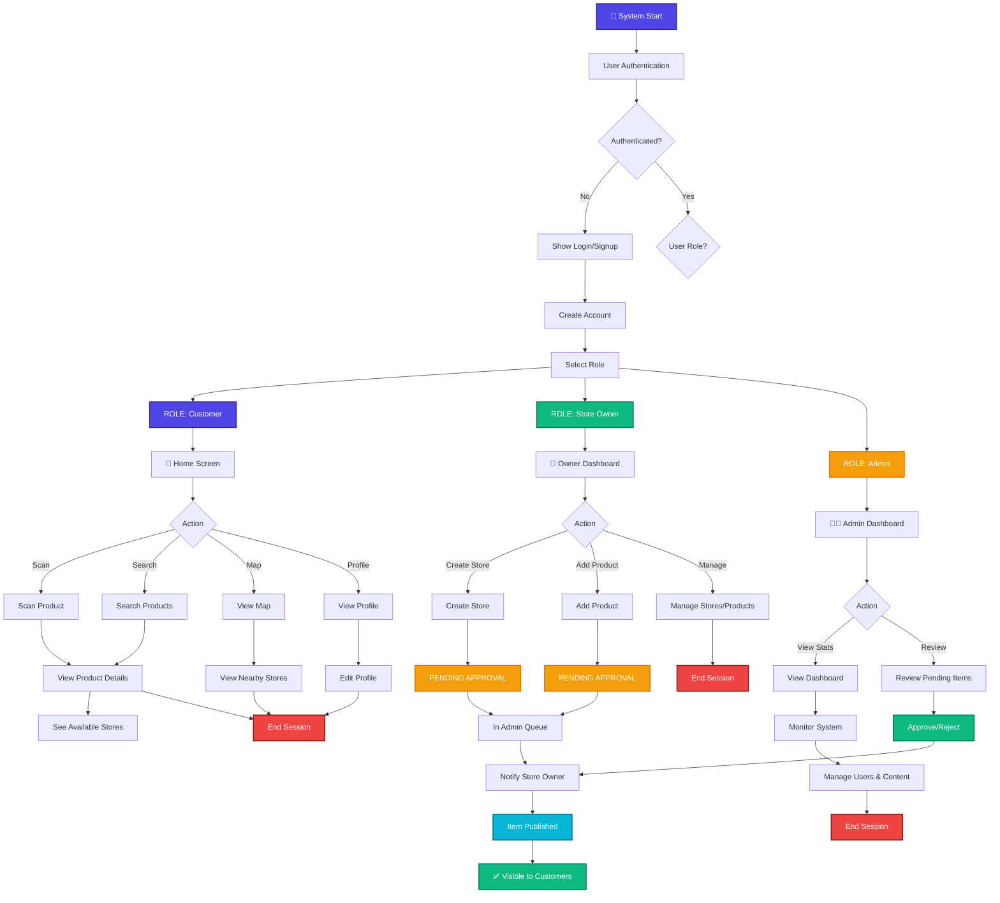

## Activity Diagram Key Symbols

| Symbol | Meaning | Usage |
|--------|---------|-------|
| 🟦 Rectangle | Activity/Action | Processing step |
| 🔷 Diamond | Decision Point | Conditional branching |
| ⭕ Circle | Start/End | Flow termination |
| ➡️ Arrow | Flow | Direction of activity |
| 🟫 Parallel Bar | Fork/Join | Concurrent activities |

## Workflow Sequences Summary

| Workflow | Actors | Steps | Approval | Time |
|----------|--------|-------|----------|------|
| **Product Scanning** | Customer | 5-7 | No | Instant |
| **Store Registration** | Store Owner, Admin | 8-10 | Yes | Minutes to Hours |
| **Product Creation** | Store Owner, Admin | 8-12 | Yes | Minutes to Hours |
| **Admin Approval** | Admin, System | 5-8 | N/A | Varies |
| **Authentication** | User, System | 4-8 | No | Instant |
| **Search/Browse** | Customer, System | 4-6 | No | Instant |
| **Profile Management** | User, System | 3-5 | No | Instant |

## Decision Points in System

### Store Owner Flow Decisions
- ✅ Location data valid?
- ✅ Barcode unique?
- ✅ All required fields filled?
- ✅ Image format acceptable?

### Admin Flow Decisions
- ✅ Store/Product meets requirements?
- ✅ Information complete?
- ✅ No policy violations?
- ✅ Ready for approval?

### Customer Flow Decisions
- ✅ Barcode successfully scanned?
- ✅ Product found in system?
- ✅ Stores available nearby?
- ✅ Continue shopping?

## Error Handling Points

| Error | Trigger | Recovery |
|-------|---------|----------|
| Invalid Barcode | Scan fails | Retry scan or manual entry |
| Duplicate Barcode | Barcode exists | Use unique barcode |
| Invalid Coordinates | Location data wrong | Re-enter correct coordinates |
| Camera Permission Denied | Permission blocked | Show permission request dialog |
| Product Not Found | No matching barcode | Suggest manual search |
| Invalid Email | Email format wrong | Show validation error |
| Weak Password | Password too simple | Show requirements |
| Network Error | Server unreachable | Retry or show offline message |

```
